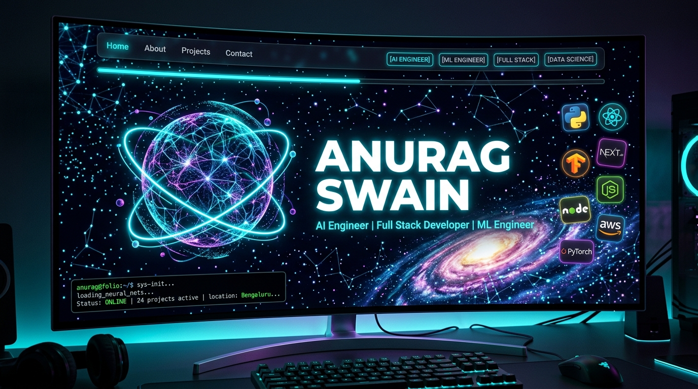
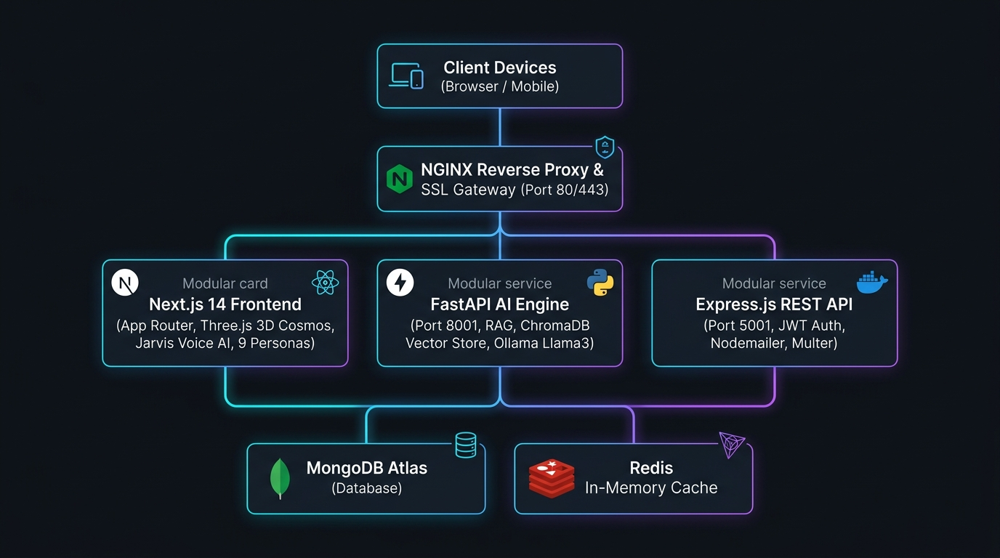

<div align="center">

<!-- Animated Header Wave Banner (Calibrated height & vertical alignment) -->


<!-- Dynamic Typing SVG Headline -->
<a href="https://anurag07.vercel.app">
  
</a>

<br/>
<br/>

<!-- Primary Status & Engagement Badges -->
[](https://anurag07.vercel.app)
[](https://github.com/HUNTER-X0s/PORTFOLIO/stargazers)
[](https://github.com/HUNTER-X0s/PORTFOLIO/network)
[](LICENSE)

<!-- Technology Stack Badges -->


<br/>

<!-- Real-time Visitor Counter -->


</div>

---

<!-- Cinematic Portfolio Hero Showcase -->
<div align="center">
  <br/>
  <h3>✨ The Ultimate AI Engineer & Full-Stack Portfolio Platform ✨</h3>
  <p><i>A cinematic, GPU-accelerated interactive experience built with Next.js 14, Three.js, RAG AI, and microservices architecture.</i></p>
  <br/>
  <a href="https://anurag07.vercel.app">
    
  </a>
  <br/>
  <sub>🌟 <b>Click the preview above to experience the live interactive web platform</b> 🌟</sub>
</div>

---

## 🌟 Complete System Architecture

<div align="center">
  
</div>

---

## 🚀 Key Feature Highlights

<table>
<tr>
<td width="50%" valign="top">

### 🌌 1. Three.js Neural Cosmos & 3D Experience
- **7,000+ Real-time Particles**: Deep space star clusters, twinkling field, glowing pulsar stars, and a dynamic spiral galaxy.
- **Holographic 3D Sphere**: Depth-reactive interactive orbital particle sphere rendered directly in the Hero viewport.
- **Lag-Free 60–120 FPS**: Intelligent resolution scaling (DPR 0.65 on desktop) with automatic tier detection for smooth frame rates.
- **On-Demand Custom Cursor**: Pure rAF physics cursor with neon cyan trail that automatically sleeps when mouse is idle.

</td>
<td width="50%" valign="top">

### 🤖 2. Intelligent RAG AI Chatbot
- **Context-Aware Retrieval**: 22 curated knowledge vectors powered by ChromaDB cosine similarity.
- **Multi-Model LLM Engine**: Powered by Ollama (`llama3` / `mistral`) with instant OpenAI fallback capability.
- **Multi-Turn Session Memory**: Retains conversation context across questions with anti-hallucination confidence scoring.
- **Dual SQLite Caching**: Zero latency on repeated queries and pre-computed embeddings.

</td>
</tr>
<tr>
<td width="50%" valign="top">

### 🎯 3. Multi-Role Dynamic Persona Switcher
- **9 Specialized Engineering Views**: Switch instantly between *AI Engineer*, *ML Engineer*, *Full Stack*, *Data Scientist*, *Backend Developer*, *Frontend Developer*, *Deep Learning Engineer*, and *SDE*.
- **Reactive UI Re-filtering**: Live adaptation of highlighted projects, tech skill bars, radar metrics, and custom "Why Hire Me" elevator pitches.

</td>
<td width="50%" valign="top">

### 🎙️ 4. Jarvis AI Voice Assistant
- **Hands-Free Interactive Voice**: Voice-directed navigation and audio answers using ElevenLabs ultra-realistic neural TTS.
- **Voice Commands**: Ask about skills, internships, projects, or say *"Hire Anurag"* for instant contact routing.
- **Dedicated Jarvis HUD**: Floating glowing audio visualizer with quick one-click Close controls.

</td>
</tr>
<tr>
<td width="50%" valign="top">

### 📊 5. Full-Stack CMS & Admin Dashboard
- **Content Management**: Create, edit, and delete projects, blogs, and certifications on the fly.
- **Secure JWT Auth**: Bcrypt password hashing, session expiration, and rate-limited brute-force lockout.
- **Live Inbox & Lead Management**: View incoming contact form submissions with auto-reply dispatch via Nodemailer.

</td>
<td width="50%" valign="top">

### 📈 6. Production-Grade SEO & Rich Snippets
- **JSON-LD Schema Suite**: `Person`, `WebSite`, `ProfilePage`, `ItemList`, and `FAQPage` schemas embedded.
- **Google Rich FAQ Snippets**: Expandable Q&A accordions directly on search engine results pages.
- **Search Console & Bing Ready**: Multi-bot `robots.ts`, section-anchored dynamic `sitemap.xml`, and strict security headers (`HSTS`, `X-Frame-Options`, `Permissions-Policy`).

</td>
</tr>
</table>

---

## 🛠️ Comprehensive Tech Stack

<div align="center">

| Domain | Technologies & Libraries |
|:---|:---|
| **Frontend Core** | `Next.js 14 (App Router)` • `React 18` • `TypeScript 5` • `Tailwind CSS` • `Zustand` |
| **Graphics & 3D** | `Three.js` • `@react-three/fiber` • `@react-three/drei` • `GLSL Shaders` |
| **Motion & Animation** | `Framer Motion` • `GSAP (GreenSock)` • `Canvas Confetti` • `Lucide React` |
| **AI & Vector Search** | `FastAPI` • `ChromaDB` • `Ollama (Llama 3)` • `LangChain` • `Sentence-Transformers` |
| **Voice & Audio** | `ElevenLabs Voice API` • `Web Audio API` • `Web Speech Recognition API` |
| **Backend Services** | `Node.js` • `Express.js` • `MongoDB` • `Mongoose` • `Redis` • `Nodemailer` • `Multer` |
| **DevOps & Hosting** | `Docker` • `Docker Compose` • `Nginx` • `GitHub Actions CI/CD` • `Vercel` • `Render` |

</div>

---

## 📂 Monorepo File & Directory Structure

```
ANURAG_PORTFOLIO/
│
├── 🎯 portfolio/                      → Main Next.js 14 Web Application (Port 3000)
│   ├── src/app/                       → App Router, layouts, metadata, SEO schemas, manifest
│   ├── src/components/
│   │   ├── ai/                        → RAG Chatbot UI & streaming message drawer
│   │   ├── animations/                → Dynamic3DCard, Dynamic3DText, ScrollReveal
│   │   ├── layout/                    → Navbar, CustomCursor, ScrollProgress, AmbientSound
│   │   ├── sections/                  → Hero, About, Skills, Projects, Experience, GitHub, Blog, Contact
│   │   ├── three/                     → Three.js ParticleField, HolographicSphere
│   │   └── voice/                     → VoiceAssistant HUD & speech synthesis controller
│   ├── src/data/                      → Master portfolio dataset (portfolio.ts)
│   └── src/lib/                       → SEO generator, JSON-LD schemas, audio/animation utilities
│
├── ⚙️ server/                         → Express.js REST API Backend (Port 5001)
│   ├── routes/                        → Auth, projects, blogs, contact, resumes, certs
│   ├── models/                        → Mongoose database schemas
│   └── middleware/                    → JWT guard, rate limiters, file upload handles
│
├── 🤖 rag-chatbot/                    → FastAPI + ChromaDB Vector RAG Engine (Port 8001)
│   ├── rag/                           → Vector embeddings, query classification, Ollama bridge
│   ├── data/                          → 22 structured knowledge base documents
│   └── cache/                         → SQLite query and embedding persistence
│
├── 🛡️ admin/                          → Admin Management Dashboard CMS (Port 3001)
│   └── app/                           → Next.js CMS interface for live data updates
│
├── 🌐 nginx/                          → Production reverse proxy & SSL termination
├── 🐳 docker-compose.yml              → Complete multi-container orchestration
├── 🔄 .github/workflows/              → Automated CI/CD build, test & deploy pipelines
└── 📚 docs/                           → Setup guides, voice configs, and architecture specs
```

---

## ⚡ Quick Start Guide

### Option 1: One-Click Docker Launch (Recommended)

Run all services simultaneously with a single command:

```bash
# 1. Clone the repository
git clone https://github.com/HUNTER-X0s/PORTFOLIO.git
cd ANURAG_PORTFOLIO

# 2. Build and launch all microservices
docker-compose up --build
```

Access your services:
- **🌐 Portfolio Frontend**: [http://localhost:3000](http://localhost:3000)
- **🛡️ Admin CMS**: [http://localhost:3001](http://localhost:3001)
- **⚙️ Backend API**: [http://localhost:5001](http://localhost:5001)
- **🤖 RAG AI API**: [http://localhost:8001](http://localhost:8001)

---

### Option 2: Local Development Setup

<details>
<summary><b>🔧 Click to expand step-by-step local setup instructions</b></summary>

#### Step 1: Start Ollama LLM (for RAG Chatbot)
```bash
ollama serve
ollama pull llama3
ollama pull nomic-embed-text
```

#### Step 2: Start the Next.js Frontend
```bash
cd portfolio
npm install
npm run dev
# Running on http://localhost:3000
```

#### Step 3: Start the Express Backend
```bash
cd server
npm install
npm run dev
# Running on http://localhost:5001
```

#### Step 4: Start the RAG Chatbot Service
```bash
cd rag-chatbot
pip install -r requirements.txt
python main.py
# Running on http://localhost:8001
```

#### Step 5: Start the Admin Panel
```bash
cd admin
npm install
npm run dev
# Running on http://localhost:3001
```

</details>

---

## 🔐 Environment Configuration

<details>
<summary><b>🔑 Click to view required environment variable templates</b></summary>

### `portfolio/.env.local`
```env
NEXT_PUBLIC_API_URL=http://localhost:5001
NEXT_PUBLIC_CHATBOT_URL=http://localhost:8001
NEXT_PUBLIC_APP_URL=https://anurag07.vercel.app
NEXT_PUBLIC_GITHUB_USERNAME=HUNTER-X0s
GOOGLE_SITE_VERIFICATION=your_google_search_console_token
BING_SITE_VERIFICATION=your_bing_webmaster_token
ELEVENLABS_API_KEY=your_elevenlabs_api_key
```

### `server/.env`
```env
PORT=5001
MONGODB_URI=mongodb://localhost:27017/portfolio
JWT_SECRET=your_super_secret_jwt_key
EMAIL_USER=your_email@gmail.com
EMAIL_PASS=your_gmail_app_password
REDIS_URL=redis://localhost:6379
```

### `rag-chatbot/.env`
```env
PORT=8001
OLLAMA_BASE_URL=http://localhost:11434
CHROMA_PERSIST_DIR=./chroma_db
OPENAI_API_KEY=your_optional_openai_fallback_key
```

</details>

---

## 👨‍💻 About the Author

<div align="center">

<a href="https://github.com/HUNTER-X0s">
  
</a>

### **Anurag Swain**
**B.Tech CSE @ GCE Kalahandi • AI/ML Engineer • Full-Stack Developer • 4x Intern**

*“Engineering Intelligence. Shipping Production Products. Solving Real-World Problems.”*

<br/>

[](https://anurag07.vercel.app)
[](https://www.linkedin.com/in/anurag-swain-cse07/)
[](https://github.com/HUNTER-X0s)
[](https://x.com/Anurag_hunter07)
[](mailto:anurag.swain35@gmail.com)

</div>

---

## ⭐ Show Your Support

<div align="center">

If you like this portfolio platform or found it inspiring for your own projects, please give it a **Star**! ⭐

[](https://github.com/HUNTER-X0s/PORTFOLIO/stargazers)
[](https://github.com/HUNTER-X0s/PORTFOLIO/fork)
[](https://twitter.com/intent/tweet?text=Check%20out%20this%20stunning%20AI-powered%203D%20portfolio%20by%20%40Anurag_hunter07%21%20🚀&url=https://github.com/HUNTER-X0s/PORTFOLIO)

> *"Every star motivates further open-source development and feature updates!"* 💙

</div>

---

## 📄 License

Distributed under the **MIT License**. See [`LICENSE`](LICENSE) for complete details.

---

<!-- Animated Footer Wave Banner -->


<div align="center">

**Crafted with 💙 and Neural Energy by [Anurag Swain](https://anurag07.vercel.app) • © 2026**

*“Engineering Intelligence. Shipping Products. Solving Problems.”*

</div>
